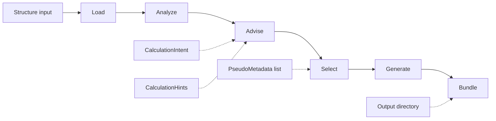

# goldilocks-core

`goldilocks-core` recommends and generates DFT calculation inputs from crystal structures, operator intent, optional hints, and pseudopotential metadata.

The public API is Python-first. The staged pipeline is also exposed through a thin CLI. A future HTTP API should wrap the same internal job request/result surface rather than reimplementing Core logic.

## Current scope

Implemented:

- structure loading from `pymatgen.Structure` or structure files readable by pymatgen
- structure analysis facts: formula, elements, symmetry, crystal system, heavy elements, magnetic candidates, electronic-character heuristic, and disorder warnings
- provenance-backed advice for k-points, smearing, magnetism, SOC, pseudopotential intent, and convergence
- selection of concrete k-point grids
- deterministic pseudopotential ranking and selection from provided metadata
- cutoff selection from pseudopotential metadata
- Quantum ESPRESSO SCF input generation
- portable output bundle directories with `manifest.json`
- shared `CoreJobRequest` / `CoreJobResult` runner for Python, CLI, and future HTTP wrappers
- UPF parsing and local pseudopotential registry loading
- ML-backed k-index to k-grid selection
- JSON-safe recommendation and job results

Not in Core:

- Runner, AiiDA, scheduling, web app, auth, sessions, or workspace state
- structure database search/fetch
- completed-output analysis
- pseudopotential downloads or private pseudo libraries

## Pipeline



Stage boundaries:

- **Load**: parse structure input. No decisions.
- **Analyze**: report structure facts. No recommendations.
- **Advise**: choose scientific and numerical intent. Record provenance.
- **Select**: resolve concrete grids, pseudopotentials, cutoffs, and warnings.
- **Generate**: translate completed advice/selection records into target-code syntax.
- **Bundle**: write generated files and a portable manifest directory.

Generators do not choose scientific defaults. If a value is needed by a generated input file, it must come from advice or selection.

## Install

```bash
uv sync
```

For development:

```bash
uv sync --group dev
```

## Python API

### Full recommendation

```python
from goldilocks_core import CalculationHints, CalculationIntent, recommend
from goldilocks_core.pseudo.pp_registry import load_pseudo_metadata

pseudo_metadata = load_pseudo_metadata("path/to/pseudopotentials")

result = recommend(
    "path/to/structure.cif",
    intent=CalculationIntent(functional="PBE"),
    hints=CalculationHints(k_spacing=0.2, pseudo_type="NC"),
    pseudo_metadata=pseudo_metadata,
)

print(result.analysis.reduced_formula)
print(result.advice.spin_orbit.consider)
print(result.selection.k_points.grid)
print(result.selection.pseudopotentials)
print(result.to_dict())
```

### Generate input files

```python
from goldilocks_core import CalculationHints, generate
from goldilocks_core.pseudo.pp_registry import load_pseudo_metadata

pseudo_metadata = load_pseudo_metadata("path/to/pseudopotentials")

result = generate(
    "path/to/structure.cif",
    hints=CalculationHints(k_grid=(4, 4, 4), pseudo_type="NC"),
    pseudo_metadata=pseudo_metadata,
)

for generated_file in result.generated_files:
    print(generated_file.path)
    print(generated_file.content)
```

### Write a portable bundle

```python
from goldilocks_core import CalculationHints, write_bundle
from goldilocks_core.pseudo.pp_registry import load_pseudo_metadata

pseudo_metadata = load_pseudo_metadata("path/to/pseudopotentials")

result = write_bundle(
    "path/to/structure.cif",
    "run/",
    hints=CalculationHints(k_grid=(4, 4, 4), pseudo_type="NC"),
    pseudo_metadata=pseudo_metadata,
)

print(result.bundle_path)
print(result.manifest)
```

Initial bundle layout:

```text
run/
├── manifest.json
└── inputs/
    └── qe.in
```

### Shared job runner

Use the job runner when a caller needs one request/result model for Python, CLI, or future HTTP surfaces.

```python
from goldilocks_core import CoreJobRequest, run_core_job
from goldilocks_core.contracts import CalculationHints

result = run_core_job(
    CoreJobRequest(
        structure="path/to/structure.cif",
        hints=CalculationHints(k_spacing=0.2),
        mode="recommend",
    )
)

print(result.to_dict())
```

`mode` controls how far the fixed graph runs:

```text
recommend -> Load → Analyze → Advise → Select
generate  -> Load → Analyze → Advise → Select → Generate
bundle    -> Load → Analyze → Advise → Select → Generate → Bundle
```

### Stage-by-stage use

Use this when notebooks, scripts, or agents need to inspect or override intermediate records.

```python
from goldilocks_core import CalculationHints
from goldilocks_core.pipeline import analyze, advise, load, select
from goldilocks_core.pseudo.pp_registry import load_pseudo_metadata

structure = load("path/to/structure.cif")
analysis = analyze(structure)

advice = advise(
    analysis,
    hints=CalculationHints(k_grid=(4, 4, 4)),
)

pseudo_metadata = load_pseudo_metadata("path/to/pseudopotentials")
selection = select(structure, advice, pseudo_metadata)

print(analysis.elements)
print(advice.k_points.provenance)
print(selection.k_points.grid)
```

Stage outputs:

```text
load(...)        -> pymatgen.core.Structure
analyze(...)     -> StructureAnalysisRecord
advise(...)      -> ParameterAdvice
select(...)      -> SelectionRecord
recommend(...)   -> CoreRecommendation
generate(...)    -> CoreRecommendation with generated_files
write_bundle(...) -> CoreJobResult with bundle_path and manifest
```

### K-mesh ML advisor

```python
from goldilocks_core.advisors import advise_kpoints
from goldilocks_core.contracts import ModelSpec
from goldilocks_core.io.structures import load_structure

structure = load_structure("path/to/structure.cif")

spec = ModelSpec(
    name="local-kmesh-model",
    version="v0",
    model_type="random_forest",
    target="k_index",
    feature_set="cslr",
    source="local",
    location="path/to/model.joblib",
)

selection = advise_kpoints(structure, spec)
print(selection.grid)
print(selection.provenance)
```

### Pseudopotentials

```python
from goldilocks_core.pseudo.parse_upf import parse_upf_metadata
from goldilocks_core.pseudo.pp_registry import filter_by_element, load_pseudo_metadata

metadata = parse_upf_metadata("path/to/Si.UPF")
print(metadata.element)
print(metadata.functional)

metadata_list = load_pseudo_metadata("path/to/pseudopotentials")
si_metadata = filter_by_element(metadata_list, "Si")
print(len(si_metadata))
```

## Result shape

```text
CoreRecommendation
├── intent: CalculationIntent
├── analysis: StructureAnalysisRecord
├── advice: ParameterAdvice
├── selection: SelectionRecord
├── generated_files: tuple[GeneratedFile, ...]
└── warnings: tuple[str, ...]
```

```text
CoreJobResult
├── request: CoreJobRequest
├── recommendation: CoreRecommendation
├── stages: tuple[StageRecord, ...]
├── generated_files: tuple[GeneratedFile, ...]
├── bundle_path: str | None
├── manifest: dict | None
└── warnings: tuple[str, ...]
```

Nested records are dataclasses with `to_dict()` methods. Tuples, paths, and structures are converted to JSON-safe values.

## CLI

### Staged Core CLI

```bash
uv run goldilocks-core recommend path/to/structure.cif --json
uv run goldilocks-core generate path/to/structure.cif --pseudo-root path/to/pseudos --k-grid 4 4 4 --json
uv run goldilocks-core bundle path/to/structure.cif --pseudo-root path/to/pseudos --k-grid 4 4 4 --out run/ --json
```

The CLI is a thin wrapper around `CoreJobRequest` and `run_core_job()`. It parses arguments, calls the package API, and prints JSON or a short human summary.

### ML k-mesh CLI

```bash
uv run goldilocks-kmesh path/to/structure.cif --model path/to/model.joblib
```

Output:

```text
recommended mesh: (n1, n2, n3)
```

## Future HTTP API mapping

Core does not depend on an HTTP framework. A future service should map HTTP JSON directly onto `CoreJobRequest` and return `CoreJobResult.to_dict()`.

Suggested endpoints:

```http
POST /recommend
POST /generate
POST /bundle
```

The HTTP layer should handle auth, uploads, workspace paths, and response transport. It should not choose k-points, pseudopotentials, cutoffs, smearing, SOC, or convergence settings.

## Package layout

```text
src/goldilocks_core/
├── __init__.py
├── contracts.py
├── jobs.py
├── pipeline.py
├── analysis.py
├── advice.py
├── selection.py
├── generation.py
├── bundle.py
├── kmesh.py
├── advisors/
├── cli/
├── io/
├── ml/
└── pseudo/
```

Responsibilities:

- `contracts.py`: public boundary dataclasses and JSON-safe serialization
- `jobs.py`: fixed Core job runner for Python, CLI, and future HTTP wrappers
- `pipeline.py`: stage wrappers and ergonomic Python API
- `analysis.py`: structure facts only
- `advice.py`: provenance-backed recommendations
- `selection.py`: concrete grids, pseudopotentials, cutoffs, warnings
- `generation.py`: target-code syntax from completed advice/selection records
- `bundle.py`: portable output directory and manifest writer
- `kmesh.py`: reciprocal-space mesh mechanics
- `advisors/`: model-backed recommendation paths
- `cli/`: thin command entry points
- `io/`: file and structure loading
- `ml/`: feature extraction, model loading, prediction
- `pseudo/`: UPF parsing, registry, filtering, policy

There is no compatibility layer for old import paths. Use one canonical API.

## Development

Run tests:

```bash
uv run pytest
```

Run lint and format checks:

```bash
uv run ruff check src tests
uv run ruff format --check src tests
```

Run the full local gate:

```bash
uv run pre-commit run --all-files
```

## Test data rules

Committed tests must not depend on `local_data/`, private pseudopotential libraries, notebooks, or machine-specific paths.

Use:

- synthetic pymatgen structures
- temporary files under `tmp_path`
- small UPF snippets in tests
- constructed dataclass instances
- fake models with `.predict()`

Real pseudopotential libraries are useful for local exploration. Convert findings into portable tests before committing.
