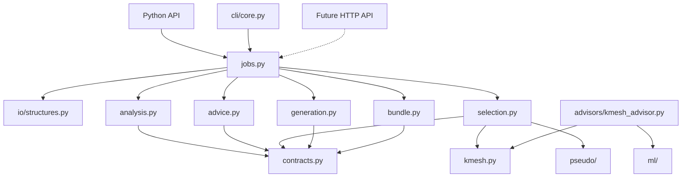
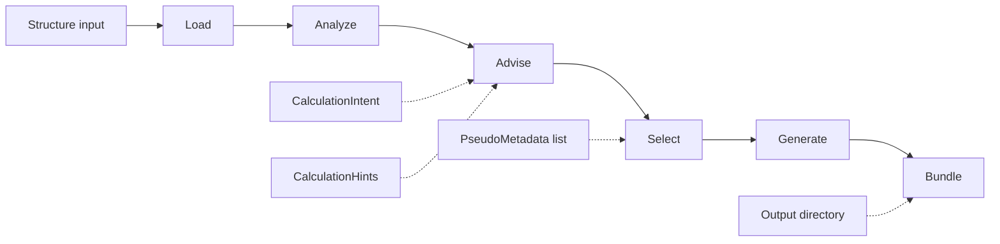

# Architecture

`goldilocks-core` is the Core package for DFT input recommendation and input generation.

Core owns:

- structure loading
- structure analysis facts
- parameter advice
- concrete selection of k-grids, pseudopotentials, and cutoffs
- code-specific input generation from completed selections
- portable bundle manifests and directory output

Core does not own:

- Runner or AiiDA workflows
- scheduler scripts
- frontend or workspace state
- auth, sessions, WebSockets, or pods
- completed-output analysis
- structure database search/fetch

## Principles

- Use domain modules. Do not add generic `helpers`, `utils`, or `processing` packages.
- Keep one canonical API. Do not add compatibility shims unless explicitly requested.
- Keep CLIs thin. Package APIs hold the logic.
- Keep future HTTP handlers thin. They should map JSON to Core request/result records.
- Keep generators mechanical. Scientific defaults belong in advice or selection.
- Keep tests portable. Do not require `local_data/` or private pseudo libraries.
- Prefer small functions and explicit dataclasses.
- Add no new external dependencies unless a stage genuinely cannot exist without one.

## Package layout

```text
src/goldilocks_core/
├── __init__.py
├── contracts.py
├── jobs.py
├── pipeline.py
├── analysis.py
├── advice.py
├── selection.py
├── generation.py
├── bundle.py
├── kmesh.py
├── advisors/
│   └── kmesh_advisor.py
├── cli/
│   ├── core.py
│   └── cli_kmesh.py
├── io/
│   └── structures.py
├── ml/
│   ├── features.py
│   ├── inference.py
│   └── models.py
└── pseudo/
    ├── parse_upf.py
    ├── pp_metadata.py
    ├── pp_policy.py
    ├── pp_registry.py
    └── pp_selector.py
```

Module dependencies should stay simple:



## Pipeline

The fixed Core graph is:



The graph is fixed. Callers choose how far to run:

```text
recommend -> Load → Analyze → Advise → Select
generate  -> Load → Analyze → Advise → Select → Generate
bundle    -> Load → Analyze → Advise → Select → Generate → Bundle
```

### Shared job surface

Owner: `jobs.py`

Inputs:

- `CoreJobRequest`

Output:

- `CoreJobResult`

Rules:

- `run_core_job()` is the shared internal operation for Python API, CLI, and future HTTP wrappers.
- It is not a scheduler, async queue, task runner, or dynamic DAG system.
- It records completed stages as `StageRecord` values.
- It delegates all scientific decisions to the stage modules.

### Load

Owner: `io/structures.py`

Input:

- `pymatgen.core.Structure`
- path to a structure file readable by `pymatgen.Structure.from_file`

Output:

- `pymatgen.core.Structure`

Rules:

- Load is pure I/O.
- Load does not analyze structures.
- Load does not recommend parameters.

### Analyze

Owner: `analysis.py`

Input:

- `pymatgen.core.Structure`

Output:

- `StructureAnalysisRecord`

Current fields include:

- formula
- reduced formula
- site count
- element symbols
- transition-metal flag
- lanthanide flag
- actinide flag
- heavy-element flag
- magnetic candidate elements
- heavy elements
- disorder warnings and disordered-site count
- space group symbol and number, where pymatgen can determine them
- crystal system, where pymatgen can determine it
- dimensionality, currently `unknown`
- electronic character, currently `likely_metal` for all-metal compositions or `unknown`
- analysis warnings

Rules:

- Analyze reports facts and conservative classifications only.
- Analyze does not choose k-points, smearing, spin, SOC, pseudopotentials, or cutoffs.
- Heavy elements use the period-5-and-heavier heuristic.
- Structure-only metallicity is uncertain; preserve uncertainty as warnings.

### Advise

Owner: `advice.py`

Inputs:

- `StructureAnalysisRecord`
- optional `CalculationIntent`
- optional `CalculationHints`

Output:

- `ParameterAdvice`

Current advice categories:

- k-points
- smearing
- magnetism
- spin-orbit coupling
- pseudopotential intent
- SCF convergence threshold, mixing beta, and max SCF steps

Rules:

- Hints override package decisions.
- Every scientific recommendation has `Provenance`.
- Heavy elements make SOC worth considering. SOC is not enabled automatically.
- Likely-metal analysis can advise cold smearing with warnings.
- Unknown metallicity uses fixed occupations and warns the operator to verify smearing manually.

### Select

Owner: `selection.py`

Inputs:

- `pymatgen.core.Structure`
- `ParameterAdvice`
- optional list of `PseudoMetadata`

Output:

- `SelectionRecord`

Current selections:

- concrete k-point grid and shift
- one pseudopotential selection per element when metadata is available
- wavefunction and charge-density cutoffs from SSSP metadata when available
- warnings for missing pseudopotentials or missing cutoff metadata

Rules:

- Selection resolves concrete values from advice.
- Selection ranks pseudo candidates deterministically by requested mode, cutoff completeness, SSSP status, source, and filename.
- Selection may warn or return incomplete pseudo selections.
- Selection does not parse files. Pseudopotential metadata must be supplied by the caller.

### Generate

Owner: `generation.py`

Inputs:

- `pymatgen.core.Structure`
- `CalculationIntent`
- `ParameterAdvice`
- `SelectionRecord`

Output:

- tuple of `GeneratedFile`

Current target:

- Quantum ESPRESSO SCF single-point input at `inputs/qe.in`

Rules:

- Generate translates completed records into target-code syntax.
- Generate does not choose k-point grids, pseudopotentials, cutoffs, smearing, spin, SOC, or convergence defaults.
- Generate raises if required pseudo or cutoff selections are missing.
- Generate raises for disordered structures rather than silently resolving occupancies.

### Bundle

Owner: `bundle.py`

Inputs:

- `CoreRecommendation` with generated files
- output directory

Output:

- `manifest.json`
- generated input files
- JSON-safe manifest dictionary

Initial layout:

```text
run/
├── manifest.json
└── inputs/
    └── qe.in
```

Rules:

- Bundle output is independent of Runner/AiiDA and frontend assumptions.
- Bundle records intent, analysis, advice, selection, generated file metadata, warnings, and provenance.
- Bundle does not silently download or copy pseudopotentials.
- Generated file paths must remain inside the bundle directory.

## Public Python API

Top-level imports:

```python
from goldilocks_core import (
    CalculationHints,
    CalculationIntent,
    CoreJobRequest,
    generate,
    recommend,
    run_core_job,
    write_bundle,
)
```

Full recommendation:

```python
result = recommend(
    "structure.cif",
    intent=CalculationIntent(functional="PBE"),
    hints=CalculationHints(k_spacing=0.2),
    pseudo_metadata=metadata_list,
)
```

Generate:

```python
result = generate(
    "structure.cif",
    hints=CalculationHints(k_grid=(4, 4, 4), pseudo_type="NC"),
    pseudo_metadata=metadata_list,
)
```

Bundle:

```python
result = write_bundle(
    "structure.cif",
    "run/",
    hints=CalculationHints(k_grid=(4, 4, 4), pseudo_type="NC"),
    pseudo_metadata=metadata_list,
)
```

Stage-by-stage:

```python
from goldilocks_core.pipeline import analyze, advise, load, select

structure = load("structure.cif")
analysis = analyze(structure)
advice = advise(analysis)
selection = select(structure, advice, metadata_list)
```

Job runner:

```python
result = run_core_job(
    CoreJobRequest(
        structure="structure.cif",
        hints=CalculationHints(k_spacing=0.2),
        mode="recommend",
    )
)
```

## Contract objects

Owner: `contracts.py`

Core contracts:

```text
CalculationIntent
CalculationHints
Provenance
StructureAnalysisRecord
ParameterAdvice
SelectionRecord
GeneratedFile
CoreRecommendation
CoreJobRequest
StageRecord
CoreJobResult
```

Supporting contracts:

```text
ModelSpec
StructureFeatureVector
KMeshEntry
KPointAdvice
KPointSelection
SmearingAdvice
MagnetismAdvice
SpinOrbitAdvice
PseudopotentialAdvice
PseudopotentialSelection
ConvergenceAdvice
```

Contract rules:

- Boundary records live in `contracts.py`.
- Domain-local metadata may live near the domain module. Example: `pseudo/pp_metadata.py`.
- Do not add duplicate models for the same concept.
- Do not add legacy import aliases.

## K-mesh paths

There are two k-mesh paths.

### Pipeline path

```text
CalculationHints -> KPointAdvice -> selection.py -> KPointSelection
```

This path is used by `recommend()`, `generate()`, `write_bundle()`, and `run_core_job()`.

### ML advisor path

```text
Structure -> CSLR features -> model prediction -> k-index -> KMeshEntry list -> KPointSelection
```

This path is used by `advise_kpoints()` and `goldilocks-kmesh`.

## Pseudopotential path

```text
UPF files -> parse_upf.py -> PseudoMetadata -> registry filters -> selection.py -> PseudopotentialSelection
```

Rules:

- UPF parsing promotes normalized metadata into `PseudoMetadata`.
- Registry helpers filter metadata lists.
- Select ranks deterministic matches from supplied metadata.
- Missing metadata is reported as warnings, not hidden defaults.
- Missing cutoff metadata is reported as warnings and blocks input generation.

## CLI

Current scripts:

```text
goldilocks-core
goldilocks-kmesh
```

### `goldilocks-core`

Thin staged job wrapper:

```bash
goldilocks-core recommend structure.cif --json
goldilocks-core generate structure.cif --pseudo-root pseudos/ --k-grid 4 4 4 --json
goldilocks-core bundle structure.cif --pseudo-root pseudos/ --k-grid 4 4 4 --out run/ --json
```

Flow:

```text
CLI args -> CoreJobRequest -> run_core_job() -> CoreJobResult -> JSON or summary
```

The CLI does not contain scientific decision logic.

### `goldilocks-kmesh`

Legacy ML-backed k-mesh path:

```bash
goldilocks-kmesh structure.cif --model model.joblib
```

Flow:

```text
CLI args -> load structure -> load model -> predict k-index -> select k-grid -> print mesh
```

## Future HTTP API

Core does not depend on HTTP frameworks. A future API service should map HTTP JSON to `CoreJobRequest` and return `CoreJobResult.to_dict()`.

Suggested endpoints:

```http
POST /recommend
POST /generate
POST /bundle
```

HTTP layers own auth, upload handling, workspace paths, and transport. They do not choose scientific values.

## Tests

Current test focus:

- structure loading and analysis
- staged contract serialization
- job request/result serialization
- advice provenance and hint override behavior
- k-spacing to k-grid selection
- pseudopotential parsing, registry, policy, ranking, and selection
- generation values derived from advice/selection records
- bundle manifest and directory layout
- staged CLI and k-mesh CLI flow
- ML model loading and prediction error paths

Rules:

- Use synthetic fixtures.
- Use `tmp_path` for files.
- Use fake models for inference tests.
- Do not use private data.

## Extension points

Next likely additions:

- more target-code generators
- richer convergence advice by task and system size
- improved dimensionality classification when reliable
- optional model-backed advice strategies
- Runner bundle consumption in a separate package

When adding these, keep the stage boundary intact:

```text
facts -> advice -> concrete selections -> syntax/output
```
