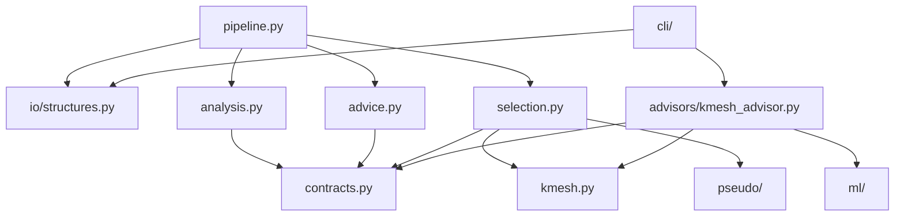
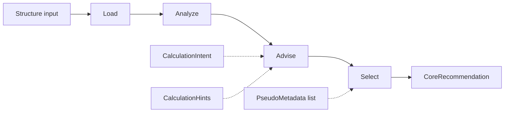
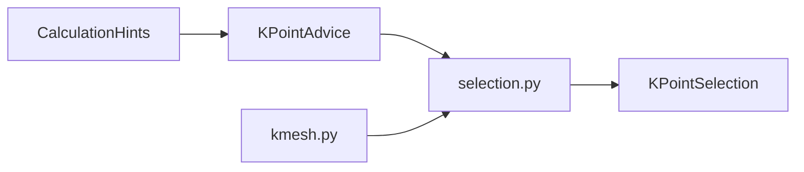
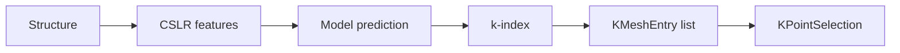
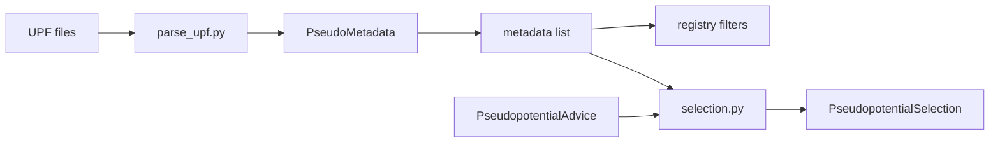
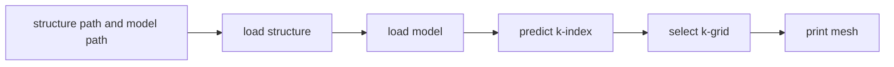

# Architecture

`goldilocks-core` is the Core package for DFT input recommendation.

Core owns:

- structure loading
- structure analysis facts
- parameter advice
- concrete selection of k-grids, pseudopotentials, and cutoffs
- recommendation manifests

Core does not own:

- Runner or AiiDA workflows
- scheduler scripts
- frontend or workspace state
- auth, sessions, WebSockets, or pods
- completed-output analysis

## Principles

- Use domain modules. Do not add generic `helpers`, `utils`, or `processing` packages.
- Keep one canonical API. Do not add compatibility shims unless explicitly requested.
- Keep CLIs thin. Package APIs hold the logic.
- Keep generators mechanical. Scientific defaults belong in advice or selection.
- Keep tests portable. Do not require `local_data/` or private pseudo libraries.
- Prefer small functions and explicit dataclasses.

## Package layout

```text
src/goldilocks_core/
├── __init__.py
├── contracts.py
├── pipeline.py
├── analysis.py
├── advice.py
├── selection.py
├── kmesh.py
├── advisors/
│   └── kmesh_advisor.py
├── cli/
│   └── cli_kmesh.py
├── io/
│   └── structures.py
├── ml/
│   ├── features.py
│   ├── inference.py
│   └── models.py
└── pseudo/
    ├── parse_upf.py
    ├── pp_metadata.py
    ├── pp_policy.py
    ├── pp_registry.py
    └── pp_selector.py
```

Module dependencies should stay simple:



## Pipeline

The main pipeline is:



### Load

Owner: `io/structures.py`

Input:

- `pymatgen.core.Structure`
- path to a structure file readable by `pymatgen.Structure.from_file`

Output:

- `pymatgen.core.Structure`

Rules:

- Load is pure I/O.
- Load does not analyze structures.
- Load does not recommend parameters.

### Analyze

Owner: `analysis.py`

Input:

- `pymatgen.core.Structure`

Output:

- `StructureAnalysisRecord`

Current fields include:

- formula
- reduced formula
- site count
- element symbols
- transition-metal flag
- lanthanide flag
- actinide flag
- heavy-element flag
- magnetic candidate elements
- heavy elements
- disorder warnings

Rules:

- Analyze reports facts only.
- Analyze does not choose k-points, smearing, spin, SOC, pseudopotentials, or cutoffs.
- Heavy elements use the period-5-and-heavier heuristic.

### Advise

Owner: `advice.py`

Inputs:

- `StructureAnalysisRecord`
- optional `CalculationIntent`
- optional `CalculationHints`

Output:

- `ParameterAdvice`

Current advice categories:

- k-points
- smearing
- magnetism
- spin-orbit coupling
- pseudopotential intent
- SCF convergence threshold

Rules:

- Hints override package decisions.
- Every scientific recommendation has `Provenance`.
- Heavy elements make SOC worth considering. SOC is not enabled automatically.
- Default smearing is fixed occupations because metallicity is not inferred yet.

### Select

Owner: `selection.py`

Inputs:

- `pymatgen.core.Structure`
- `ParameterAdvice`
- optional list of `PseudoMetadata`

Output:

- `SelectionRecord`

Current selections:

- concrete k-point grid and shift
- one pseudopotential selection per element when metadata is available
- wavefunction and charge-density cutoffs from SSSP metadata when available
- warnings for missing pseudopotentials or missing cutoff metadata

Rules:

- Selection resolves concrete values from advice.
- Selection may warn or return incomplete pseudo selections.
- Selection does not parse files. Pseudopotential metadata must be supplied by the caller.

### Generate and Bundle

Generate is not implemented yet.

Bundle currently means JSON-safe manifest serialization:

```python
manifest = recommendation.to_dict()
```

Future generators must consume completed advice and selection records. They must not invent scientific defaults.

## Public Python API

Top-level imports:

```python
from goldilocks_core import CalculationHints, CalculationIntent, recommend
```

Full pipeline:

```python
result = recommend(
    "structure.cif",
    intent=CalculationIntent(functional="PBE"),
    hints=CalculationHints(k_spacing=0.2),
    pseudo_metadata=metadata_list,
)
```

Stage-by-stage:

```python
from goldilocks_core.pipeline import analyze, advise, load, select

structure = load("structure.cif")
analysis = analyze(structure)
advice = advise(analysis)
selection = select(structure, advice, metadata_list)
```

## Contract objects

Owner: `contracts.py`

Core contracts:

```text
CalculationIntent
CalculationHints
Provenance
StructureAnalysisRecord
ParameterAdvice
SelectionRecord
CoreRecommendation
```

Supporting contracts:

```text
ModelSpec
StructureFeatureVector
KMeshEntry
KPointAdvice
KPointSelection
SmearingAdvice
MagnetismAdvice
SpinOrbitAdvice
PseudopotentialAdvice
PseudopotentialSelection
ConvergenceAdvice
GeneratedFile
```

Contract rules:

- Boundary records live in `contracts.py`.
- Domain-local metadata may live near the domain module. Example: `pseudo/pp_metadata.py`.
- Do not add duplicate models for the same concept.
- Do not add legacy import aliases.

## K-mesh paths

There are two k-mesh paths.

### Pipeline path



This path is used by `recommend()`.

### ML advisor path



This path is used by `advise_kpoints()` and the current CLI.

## Pseudopotential path



Rules:

- UPF parsing promotes normalized metadata into `PseudoMetadata`.
- Registry helpers filter metadata lists.
- Select chooses deterministic matches from supplied metadata.
- Missing metadata is reported as warnings, not hidden defaults.

## CLI

Current script:

```text
goldilocks-kmesh
```

Flow:



The CLI does not expose the full staged recommendation pipeline yet.

## Tests

Current test focus:

- structure loading and analysis
- staged contract serialization
- advice provenance and hint override behavior
- k-spacing to k-grid selection
- pseudopotential parsing, registry, policy, and selection
- ML model loading and prediction error paths
- CLI argument/main flow

Rules:

- Use synthetic fixtures.
- Use `tmp_path` for files.
- Use fake models for inference tests.
- Do not use private data.

## Extension points

Next likely additions:

- code-specific Generate stage
- output bundle directory writer
- full staged CLI command
- richer pseudopotential ranking
- more complete convergence and smearing advice
- optional model-backed advice strategies

When adding these, keep the stage boundary intact:

```text
facts -> advice -> concrete selections -> syntax/output
```
