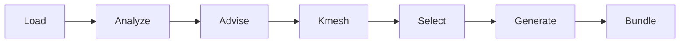
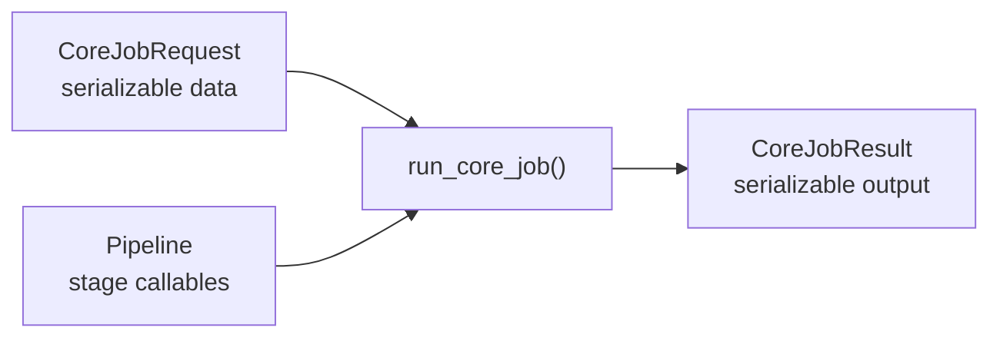

# Architecture

`goldilocks-core` is the Core package for DFT input recommendation and input generation.

Core owns:

- structure loading
- structure analysis facts
- parameter advice
- k-point resolution
- concrete pseudopotential and cutoff selection
- code-specific input generation from completed selections
- portable bundle manifests and directory output
- composable stage backend injection through `Pipeline`

Core does not own:

- Runner or AiiDA workflows
- scheduler scripts
- frontend or workspace state
- auth, sessions, WebSockets, or pods
- completed-output analysis
- structure database search/fetch
- backend-name registries for HTTP or CLI services

## Principles

- Keep one canonical API. Do not add compatibility shims unless explicitly requested.
- Use SOLID boundaries: each stage owns one responsibility, and `run_core_job()` depends on injected stage callables instead of concrete implementations.
- Prefer composition over inheritance. Backends are functions composed into `Pipeline`; they are not subclasses.
- Keep `CoreJobRequest` data-only and serializable.
- Keep executable backend choice outside request data.
- Keep CLIs thin. They may resolve command-line options into a `Pipeline`, then call Core.
- Keep future HTTP handlers thin. They may resolve JSON backend names into callables outside Core, then call Core.
- Keep generators mechanical. Scientific defaults belong in advice, Kmesh, or selection.
- Keep tests portable. Do not require `local_data/` or private pseudo libraries.
- Add no new external dependencies unless a stage genuinely cannot exist without one.

## Package layout

```text
src/goldilocks_core/
├── __init__.py
├── contracts.py
├── jobs.py
├── pipeline.py
├── analysis.py
├── advice.py
├── selection.py
├── generation.py
├── bundle.py
├── kmesh.py
├── advisors/
│   └── kmesh_advisor.py
├── cli/
│   ├── core.py
│   └── cli_kmesh.py
├── io/
│   └── structures.py
├── ml/
│   ├── features.py
│   ├── inference.py
│   └── models.py
└── pseudo/
    ├── parse_upf.py
    ├── pp_metadata.py
    ├── pp_policy.py
    ├── pp_registry.py
    └── pp_selector.py
```

## Dependency direction

`contracts.py` defines boundary records and callable signatures. Stage modules import contracts; contracts do not import stage modules.

`jobs.py` owns the job runner and the built-in `default_pipeline()` composition.

`pipeline.py` owns user-facing convenience wrappers (`recommend`, `generate`, `write_bundle`) and stage-by-stage wrappers.

Stage modules own domain behavior:

```text
analysis.py   -> structure facts
advice.py     -> parameter intent and provenance
kmesh.py      -> concrete k-point resolution
selection.py  -> pseudopotentials, cutoffs, selection warnings
generation.py -> target-code text
bundle.py     -> portable output directory
```

## Fixed graph, swappable backends

The Core graph is fixed:



Request data and backend composition enter the runner separately:



Callers choose how far to run:

```text
recommend -> Load → Analyze → Advise → Kmesh → Select
generate  -> Load → Analyze → Advise → Kmesh → Select → Generate
bundle    -> Load → Analyze → Advise → Kmesh → Select → Generate → Bundle
```

The graph is not dynamic. There is no scheduler or DAG engine. The backend behind each computational stage is injectable through `Pipeline`.

## Request versus Pipeline

`CoreJobRequest` is job data:

```python
CoreJobRequest(
    structure="Si.cif",
    intent=CalculationIntent(functional="PBE"),
    hints=CalculationHints(k_spacing=0.2),
    mode="recommend",
    pseudo_metadata=tuple(metadata),
)
```

`Pipeline` is executable composition:

```python
from dataclasses import replace

pipeline = replace(default_pipeline(), kmesh=ml_kmesh_advisor(spec))
result = run_core_job(request, pipeline=pipeline)
```

This separation is intentional:

- requests can cross JSON/HTTP boundaries
- pipelines can carry Python callables
- Core does not need registries or string resolution
- provenance still records which source produced each result

## Stage ownership

### Load

Owner: `io/structures.py`

Input:

- `pymatgen.core.Structure`
- path readable by `pymatgen.Structure.from_file`

Output:

- `pymatgen.core.Structure`

Rules:

- pure I/O
- no analysis
- no recommendations

Load is recorded as a `StageRecord`, but it is not a `Pipeline` field.

### Analyze

Owner: `analysis.py`

Input:

- `Structure`

Output:

- `StructureAnalysisRecord`

Rules:

- report facts and conservative classifications only
- do not choose parameters
- preserve uncertainty as warnings

### Advise

Owner: `advice.py`

Inputs:

- `StructureAnalysisRecord`
- `CalculationIntent`
- `CalculationHints`

Output:

- `ParameterAdvice`

Rules:

- hints override package decisions
- every recommendation has `Provenance`
- output is intent, not concrete target-code syntax
- k-point output is `KPointAdvice`, not a final grid

### Kmesh

Owner: `kmesh.py` and `advisors/kmesh_advisor.py`

Inputs:

- `Structure`
- `CalculationHints`
- `KPointAdvice`

Output:

- `KPointSelection`

Rules:

- operator k-point hints always win
- default backend converts advice to a grid
- ML backend uses model prediction when no k-point hint is set
- provenance must distinguish `user_hint`, `default`, and `model`

### Select

Owner: `selection.py`

Inputs:

- `Structure`
- `ParameterAdvice`
- `KPointSelection`
- `PseudoMetadata` sequence

Output:

- `SelectionRecord`

Rules:

- do not recalculate k-points
- select pseudos and cutoffs deterministically
- warn instead of inventing missing metadata

### Generate

Owner: `generation.py`

Inputs:

- `Structure`
- `CalculationIntent`
- `ParameterAdvice`
- `SelectionRecord`

Output:

- tuple of `GeneratedFile`

Rules:

- translate completed records into target-code syntax
- do not choose scientific defaults
- raise when required pseudo/cutoff selections are incomplete

### Bundle

Owner: `bundle.py`

Inputs:

- `CoreRecommendation` with generated files
- output directory

Output:

- manifest dictionary and files on disk

Rules:

- deterministic layout
- no Runner/AiiDA/frontend assumptions
- reject generated paths escaping the output directory

## Extension points

Each `Pipeline` field is an extension point:

```python
Pipeline(
    analyze=...,
    advise=...,
    kmesh=...,
    select=...,
    generate=...,
    bundle=...,
)
```

The default composition is:

```python
def default_pipeline() -> Pipeline:
    return Pipeline(
        analyze=analyze_structure,
        advise=advise_parameters,
        kmesh=resolve_kpoints_from_advice,
        select=select_parameters,
        generate=generate_inputs,
        bundle=write_bundle_directory,
    )
```

Use `dataclasses.replace()` to customize one stage:

```python
pipeline = replace(default_pipeline(), generate=my_generator)
```

See [pipeline](pipeline.md) and [backends](backends.md) for full backend contracts.
