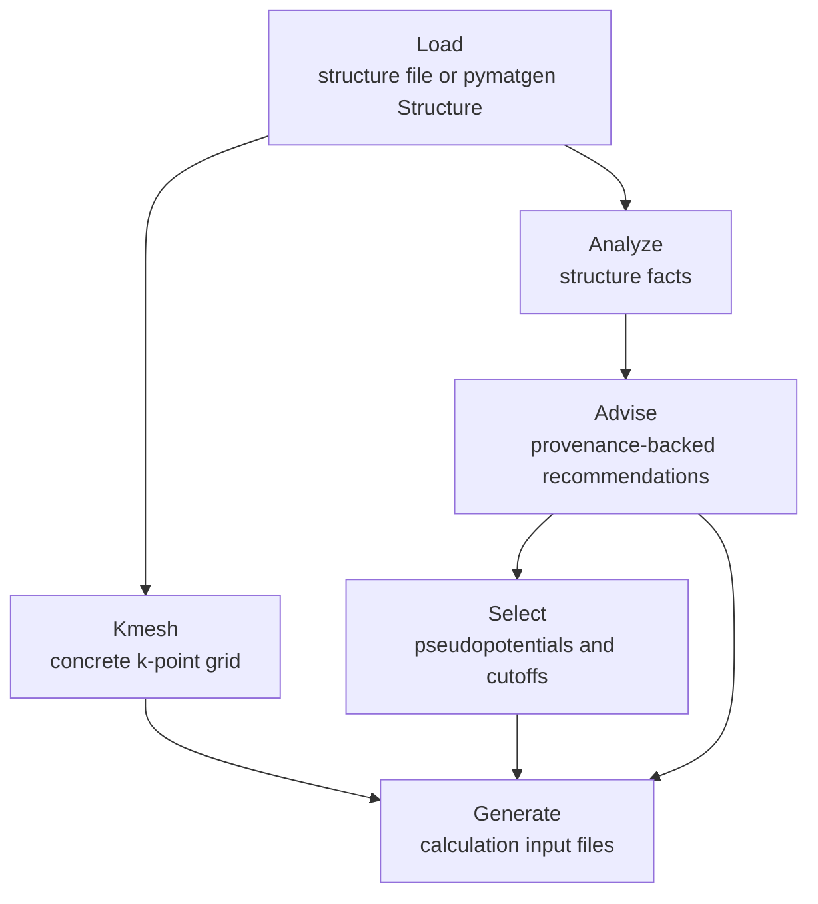

# Architecture

goldilocks-core is a Python package that recommends inputs for **DFT**
(density functional theory) simulations of materials. You give it a crystal
structure and a calculation intent; it returns analysis facts, scientifically
justified parameter recommendations, concrete k-point grids, pseudopotential
selections, and (optionally) rendered Quantum ESPRESSO SCF input files.

This document describes the current architecture for readers with no prior
context. For step-by-step usage see the [tutorial](tutorial.md); for the
transport servers (HTTP, MCP) see [transport](transport.md).

## Glossary

| Term | Meaning |
| --- | --- |
| DFT | Density functional theory — the simulation method these inputs target. |
| SCF | Self-consistent-field calculation — the one calculation task currently implemented. |
| Pseudopotential | Per-element approximation replacing core electrons; selected per element. |
| k-points | Reciprocal-space sampling grid; resolved by the Kmesh stage. |
| Provenance | Per-value record of *why* a recommendation was made (source, reason, warnings). |
| QE | Quantum ESPRESSO, the only DFT code currently supported for file generation. |

## The staged pipeline

Work flows through a fixed set of stages. Each stage is a plain function that
takes explicit prior-stage records and returns one typed record. There is no
workflow engine, plugin registry, service container, or stage base class.


```mermaid
flowchart TD
    L[Load<br/>structure file or pymatgen Structure]
    A[Analyze<br/>structure facts]
    K[Kmesh<br/>concrete k-point grid]
    V[Advise<br/>provenance-backed recommendations]
    S[Select<br/>pseudopotentials and cutoffs]
    G[Generate<br/>calculation input files]

    L --> A
    L --> K
    A --> V
    V --> S
    K --> G
    S --> G
    V --> G
```

Dependency edges:

- **Load** reads a `pymatgen.Structure` or a structure file path.
- **Analyze** needs only the structure. It reports facts (formula, elements,
  dimensionality, symmetry, electronic-character heuristic), never decisions.
- **Kmesh** needs only the structure. It resolves operator k-point hints into a
  concrete grid, or delegates to a model backend. `analyze` and `kmesh` are
  parallel roots — neither consumes the other.
- **Advise** needs `analyze`. It returns provenance-backed recommendations for
  smearing, magnetism, SOC, pseudopotential family, convergence, and vdW.
- **Select** needs `advise` (not `kmesh`). It ranks available pseudopotential
  metadata into concrete per-element selections and cutoffs.
- **Generate** needs the structure, `advice`, `selection`, and `k_points`. It
  renders calculation input files for the requested code/task.

Bundle output (writing generated files plus a `manifest.json` to a new
directory) is a side effect of `generate` when an `output_dir` is given, not a
separate pipeline stage.

## Two layers

The package exposes two layers over the same stages.

### 1. Pure stage functions (Python API)

Each stage is a directly importable function taking explicit prior records:

```python
from goldilocks_core.advice import advise_parameters
from goldilocks_core.analysis import analyze_structure
from goldilocks_core.advisors import default_kmesh_advisor
from goldilocks_core.generation import generate_inputs
from goldilocks_core.io.structures import load_structure
from goldilocks_core.kmesh import resolve_kpoints
from goldilocks_core.selection import select_parameters

structure = load_structure("Fe.cif")
analysis = analyze_structure(structure)
advice = advise_parameters(analysis, intent, hints)
k_points = resolve_kpoints(structure, hints, default_kmesh_advisor())
selection = select_parameters(structure, advice, pseudo_metadata)
files = generate_inputs(structure, intent, advice, selection, k_points)
```

Use this layer for custom ordering, intermediate inspection, or composing
project-specific steps. No framework needs extending.

### 2. `CoreRuntime` convenience entrypoints

`CoreRuntime` (`goldilocks_core.runtime`) owns the composed entrypoints every
transport uses. It takes a single `CoreJobRequest` and runs the sub-graph each
entrypoint needs:

| Entrypoint | Sub-graph | Returns |
| --- | --- | --- |
| `analyze(request)` | Load → Analyze | `StructureAnalysisRecord` |
| `kmesh(request)` | Load → Kmesh | `KPointSelection` |
| `advise(request)` | Load → Analyze → Advise | `ParameterAdvice` |
| `select(request)` | Load → Analyze → Advise → Select | `SelectionRecord` |
| `recommend(request)` | Load → Analyze → Advise → Kmesh → Select | `CoreResult` |
| `generate(request, *, output_dir=None)` | full path through Generate | `CoreResult` |

`CoreRuntime` also owns **model lifecycle**. ML model resources load lazily on
first use and are reused across jobs run through the same instance. `reset()`
discards cached model state (the next job reloads); `close()` releases it. It
is a context manager. **There is no module-global default runtime** — callers
create and own their own.

```python
from goldilocks_core import CoreRuntime, CoreJobRequest, CalculationHints

with CoreRuntime() as runtime:
    a = runtime.recommend(CoreJobRequest(structure="Fe.cif"))
    b = runtime.recommend(CoreJobRequest(structure="Fe.cif", hints=CalculationHints(k_grid=(4, 4, 4))))
    # both calls share one loaded model backend
```

`run_core_job(request, *, runtime=None)` (in `jobs.py`) is the thin dispatch
helper. With `runtime=None` it creates a fresh `CoreRuntime` for the call and
closes it when finished. Pass a `runtime=` to reuse model state across calls.
It dispatches `intent.task` to a registered path function; the built-in SCF
path is `run_scf`. The convenience functions `recommend(...)` and
`generate(...)` build a `CoreJobRequest` and call `run_core_job`.

## Transports

Four transports delegate to the same `CoreRuntime` entrypoints:

- **Library API** — import `CoreRuntime` (or `run_core_job`/`recommend`/`generate`).
- **CLI** — `goldilocks-core` subcommands; raw stage commands call the
  `CoreRuntime` entrypoints directly inside a short-lived runtime.
- **HTTP** — FastAPI app (`server/http.py`) owning one long-lived `CoreRuntime`.
- **MCP** — MCP server over stdio (`server/mcp.py`) owning one long-lived
  `CoreRuntime`.

The CLI and library API are always available. HTTP and MCP live behind optional
extras (`[http]`, `[mcp]`) and are imported lazily so a plain
`import goldilocks_core` never pulls them in. See [transport.md](transport.md).

## Modules

| Module | Responsibility |
| --- | --- |
| `contracts/` | Typed records, type aliases, protocols, validation, and `to_jsonable` serialization. |
| `runtime.py` | `CoreRuntime`: model lifecycle and composed entrypoints. |
| `jobs.py` | `run_core_job` task dispatch and `recommend`/`generate` helpers. |
| `io/structures.py` | Structure loading. |
| `analysis.py` | Structure facts only. |
| `advice/` | Provenance-backed recommendations (smearing, magnetism, SOC, pseudo, convergence, vdW). |
| `kmesh/` | K-point grid resolution (`resolve_kpoints`) and mesh math. |
| `advisors/` | Concrete k-point backends: `QrfKDistanceBackend` (default) and `ml_kmesh_advisor`/`advise_kpoints`. |
| `selection.py` | Pseudopotential ranking and cutoff extraction. |
| `generation/` | Calculation-specific file generation; writer dispatch by code/task. |
| `bundle.py` | Portable bundle directory + `manifest.json` output. |
| `server/` | HTTP and MCP transports plus shared `from_dict` request parser. |
| `cli/` | Thin CLI wrappers. |
| `pseudo/` | UPF parsing, metadata, registry loading, and selection policy. |
| `ml/` | ML model registry and QRF/k-index inference. |
| `examples/` | Bundled example structures. |

## Contracts sub-package

`contracts/` holds the boundary data shared between stages and across
transports:

- `records.py` — frozen/slots dataclasses (`CoreJobRequest`, `CoreResult`,
  `StructureAnalysisRecord`, `ParameterAdvice`, `KPointSelection`,
  `SelectionRecord`, `GeneratedFile`, `BundleRecord`, `ModelSpec`, etc.).
- `types.py` — type aliases and `Literal` sets (`JobMode`, `CodeName`,
  `CalcTask`, `ProvenanceSource`, ...).
- `protocols.py` — `KMeshAdvisor` and `ModelRuntime` protocols.
- `validate.py` — request-boundary validators for hints.
- `serial.py` — `to_jsonable`, the single JSON serialization path used by every
  `to_dict()`.

`SelectionRecord` is pseudos-only (k-points live on `CoreResult.k_points`).
`CoreResult.k_points` carries the Kmesh-stage grid alongside the Select-stage
pseudos. Every record has `to_dict()` returning a JSON-safe mapping.

## Calculation tasks

`run_core_job` dispatches `intent.task` through a `_PATHS` table in `jobs.py`
mapping each task to a path function. The built-in entry is
`scf_single_point` → `run_scf`. Task names are not closed in the shared
contract. A new task (magnetic, NSCF, phonons) is added by registering another
path function that composes the shared stages. For one-off or experimental
sequences, compose the stage functions directly.

## Boundaries

Validate where data enters or causes side effects:

- request records validate operator controls (`CalculationHints`, `CalculationIntent`);
- the transport `from_dict` parser rejects unknown keys and bad types;
- pseudopotential selection treats metadata as untrusted;
- generators reject unsupported or incomplete inputs before rendering;
- bundle writing confines paths to a new output directory.

Intermediate records are ordinary Python data. Stage authors are responsible
for returning coherent records; Core does not defensively re-check every
possible malformed internal object. Errors propagate — there are no catch-all
fallbacks or failure-state machinery.

## What is not here

Runner/AiiDA workflows, schedulers, execution scripts, auth, sessions,
frontend, WebSocket, pod management, and completed-output analysis are outside
this package. Generated inputs are not executed here.