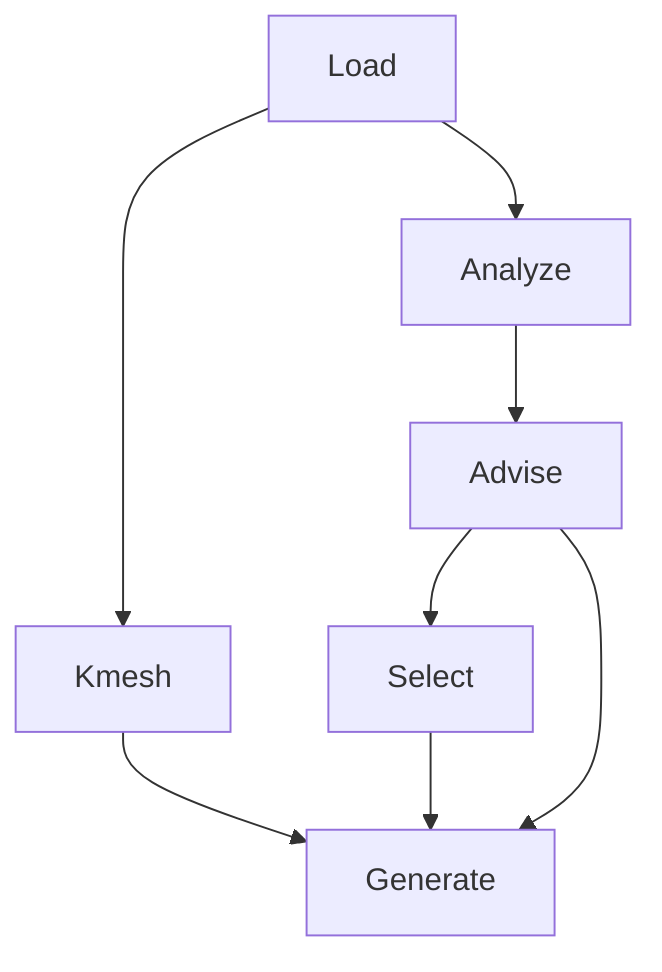

# Pipeline

The Goldilocks recommendation pipeline is a fixed set of stages. This page
documents the current stage signatures and records. For the high-level
architecture and the two API layers (pure stage functions vs `CoreRuntime`),
see [architecture.md](architecture.md). For a from-scratch walkthrough see
[tutorial.md](tutorial.md).

## Stage list

| Stage | Function | Output record |
| --- | --- | --- |
| Load | `load_structure` (`io.structures`) | `pymatgen.Structure` |
| Analyze | `analyze_structure` (`analysis`) | `StructureAnalysisRecord` |
| Advise | `advise_parameters` (`advice`) | `ParameterAdvice` |
| Kmesh | `resolve_kpoints` (`kmesh`) | `KPointSelection` |
| Select | `select_parameters` (`selection`) | `SelectionRecord` |
| Generate | `generate_inputs` (`generation`) | `tuple[GeneratedFile, ...]` |

Dependency edges (Analyze and Kmesh are parallel roots; Select does not depend
on Kmesh; Generate needs advice, selection, and k_points):



## Standard use

The convenience functions build a `CoreJobRequest` and run it through
`run_core_job` with a fresh `CoreRuntime`:

```python
from goldilocks_core import CalculationHints, generate

result = generate(
    "Fe.cif",
    hints=CalculationHints(k_grid=(6, 6, 6), spin_polarized=True),
    pseudo_metadata=metadata,
)

for generated_file in result.generated_files:
    print(generated_file.path)
```

The convenience functions are:

- `recommend(...)`: Load → Analyze → Advise → Kmesh → Select.
- `generate(...)`: also run Generate. (To write a bundle directory, use
  `run_core_job` with `mode="generate"` and `output_dir=...`, or `generate --out`
  on the CLI.)

Both return `CoreResult`.

## Request and dispatch

`CoreJobRequest` is the single serializable job object. `run_core_job`
dispatches on `intent.task` to a path function (`run_scf` for SCF) that
composes the stages. `mode` controls how far the path runs:

- `recommend`: stops after Select.
- `generate`: runs through Generate. When `output_dir` is also given, a bundle
  directory is published.

```python
from goldilocks_core import CoreJobRequest, run_core_job

result = run_core_job(
    CoreJobRequest(
        structure="Fe.cif",
        mode="generate",
        pseudo_metadata=tuple(metadata),
    )
)
```

To write files to disk, pass `output_dir`:

```python
result = run_core_job(
    CoreJobRequest(
        structure="Fe.cif",
        mode="generate",
        pseudo_metadata=tuple(metadata),
        output_dir="run/",
    )
)
print(result.bundle.path)   # "run/"
```

## CoreRuntime entrypoints

`CoreRuntime` owns the composed entrypoints. Each takes one `CoreJobRequest`
and runs only its prerequisite sub-graph:

```python
from goldilocks_core import CoreRuntime, CoreJobRequest

with CoreRuntime() as runtime:
    analysis = runtime.analyze(CoreJobRequest(structure="Fe.cif"))
    advice = runtime.advise(CoreJobRequest(structure="Fe.cif"))
    k_points = runtime.kmesh(CoreJobRequest(structure="Fe.cif"))
    selection = runtime.select(CoreJobRequest(structure="Fe.cif", pseudo_metadata=tuple(metadata)))
    result = runtime.recommend(CoreJobRequest(structure="Fe.cif"))
    generated = runtime.generate(CoreJobRequest(structure="Fe.cif", mode="generate"))
```

Model state is reused across calls on the same runtime. `reset()` discards
cached model state; `close()` releases it.

## Current stage signatures

```python
# analysis.py
analyze_structure(structure: Structure) -> StructureAnalysisRecord

# advice/parameters.py
advise_parameters(
    analysis: StructureAnalysisRecord,
    intent: CalculationIntent,
    hints: CalculationHints,
) -> ParameterAdvice

# kmesh/resolve.py
resolve_kpoints(
    structure: Structure,
    hints: CalculationHints,
    backend: KMeshAdvisor,
) -> KPointSelection

# selection.py  — pseudos only; k_points are not taken here
select_parameters(
    structure: Structure,
    advice: ParameterAdvice,
    metadata_list: Sequence[PseudoMetadata] | None = None,
) -> SelectionRecord

# generation/registry.py
generate_inputs(
    structure: Structure,
    intent: CalculationIntent,
    advice: ParameterAdvice,
    selection: SelectionRecord,
    k_points: KPointSelection,
) -> tuple[GeneratedFile, ...]
```

Note the k_points split: `select_parameters` takes `structure`, `advice`, and
`pseudo_metadata` (no k-points); `generate_inputs` takes `k_points` as a
sibling argument. `SelectionRecord` carries pseudopotentials and warnings
only; the k-point grid lives on `CoreResult.k_points`.

## K-point backends

K-points are resolved by `resolve_kpoints(structure, hints, backend)`. Explicit
`k_grid` wins over `k_spacing`; both beat the model backend. The default
backend is the built-in QRF k-distance model; explicit hints bypass model
loading entirely.

To use a local k-index model instead of the default, put a `ModelSpec` on the
request:

```python
from goldilocks_core import CoreJobRequest, run_core_job
from goldilocks_core.contracts import ModelSpec

spec = ModelSpec(
    name="local-kmesh",
    version="1",
    model_type="random_forest",
    target="k_index",
    feature_set="cslr",
    source="local",
    location="model.joblib",
)

result = run_core_job(
    CoreJobRequest(structure="Fe.cif", mode="recommend", kmesh_model=spec)
)
```

The model spec is request data, so it serializes alongside the rest of the job.

## Compose stages directly

Callers are not required to use `run_core_job` or `CoreRuntime`:

```python
from goldilocks_core.advice import advise_parameters
from goldilocks_core.analysis import analyze_structure
from goldilocks_core.advisors import default_kmesh_advisor
from goldilocks_core.generation import generate_inputs
from goldilocks_core.io.structures import load_structure
from goldilocks_core.kmesh import resolve_kpoints
from goldilocks_core.selection import select_parameters

structure = load_structure("Fe.cif")
analysis = analyze_structure(structure)
advice = advise_parameters(analysis, intent, hints)
k_points = resolve_kpoints(structure, hints, default_kmesh_advisor())
selection = select_parameters(structure, advice, metadata)
files = generate_inputs(structure, intent, advice, selection, k_points)
```

Use this form to inspect intermediate records, insert project-specific work,
reuse only part of the pipeline, or drive a calculation family with a different
sequence.

## Stage responsibilities

- **Load** reads a `pymatgen.Structure` or structure file.
- **Analyze** reports structure facts only.
- **Advise** recommends physics and numerical settings with provenance.
- **Kmesh** resolves operator hints or a model into a concrete grid.
- **Select** chooses pseudopotentials and cutoffs (no k-points).
- **Generate** maps completed choices to calculation input files.

The standard graph is intentionally simple. More complex workflows belong in
calling Python code or a Runner, not a DAG system inside Core.